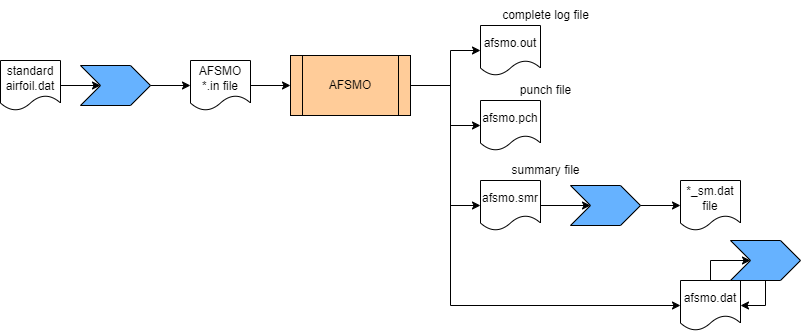
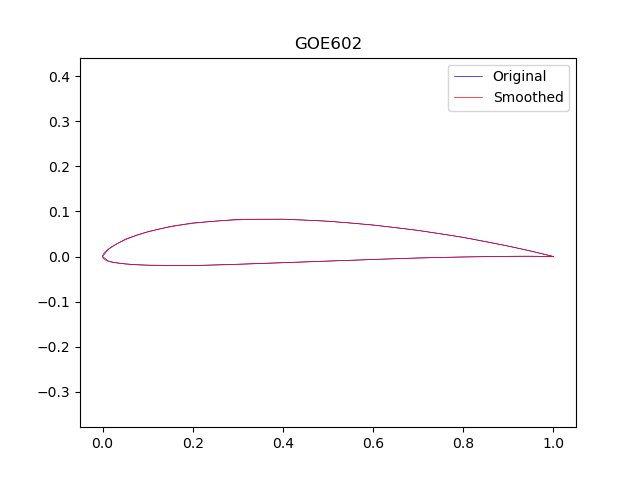
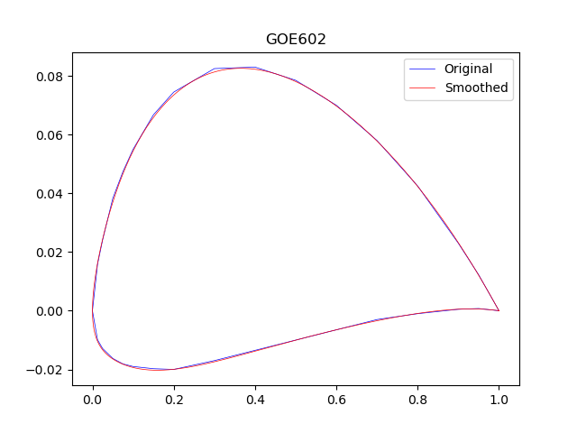
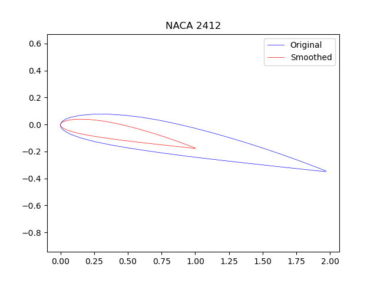
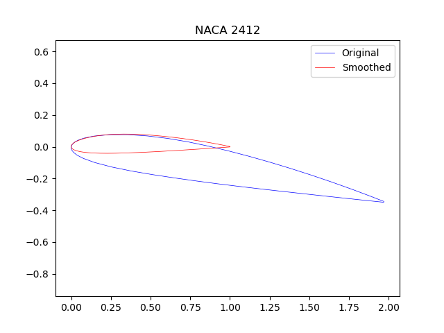

# AFSMO

A simple Python Wrapper for NASA AFSMO program [TM-84666]. 
Original AFSMO source code was downloaded from [PDAS](https://www.pdas.com/afsmoothdownload.html).

Special thanks goes for Prof. Michael Selig for providing the AFSMO program and helping out in countless ways throughout.

## Installation

```bash
pip install numpy matplotlib argparse scipy
```

AFSMO fortran source code can be compiled in Unix systems easily using gfortran, and using a free Intel Fortran compiler in Windows

```bash
gfortran -w afsmo.f -o afsmo
ifort afsmo.f
```

## Data/Process Flow

The below diagam outlines the dataflow through the program. Blue highlighed functions take place through afsmo.py



**afsmo.out** contains complete log of the smoothing operation. useful in case if someone tries to understand what caused a failure or an error. 

**afsmo.pch** contains the punch file. as outlined in the TM-84666, and help text, what goes into the pch file can be controlled by --ipunch switch.

**afsmo.smr** contains smoothed original cordinates along with first and second derivate data.

**afsmo.da**t contains interpolated airfoil cordinates. this file is used as a side-effect if someone prefers AFSMO built in interpolation scheme. python wrapper changes this file inplace as a standard dat file for ease of use.

## Usage

```bash
D:\AFSMO>python afsmo.py -h
usage: afsmo.py [-h] [-d] [-i] [-n] [-p] [-a] [--max-iter] [--ipunch] [--icamtk] [--ibad] [--itrn]

A simple wrapper for NASA AFSMO airfoil smoothing program

optional arguments:
  -h, --help         show this help message and exit
  -d , --dat-file    Input *.dat file name
  -i, --interpolate  Dat file with (n) interpolated x coordinates will be generated when set
                     Default => True
  -n , --n-inter     Number of cosine spaced points to be interpolated
                     Default =>  160
  -p, --plotter      Plots the original and Smoothed airfoils
                     Default => True
  -a, --aspect       Uses real aspect ratio for plotting
                     Default => True

Advanced options:
  --max-iter         Maximum Number Of Smoothing Iterations
                             Default =>80
  --ipunch           Ipunch - Punch Output Option
                         0 - No Punched Output
                         1 - Smoothed (X,Y,W) Punched
                         2 - Smoothed (Theta,Y/C,W) Punched
                         3 - Smoothed (Theta,Yps,W) Punched
                             (Ylte, Ynose, And Yute Also Punched)
                         4 - Smoothed (Theta,Ypps,W) Punched
                             (Ylte, Ynose, And Yute Also Punched)
                         5 - Thickness And Camber Distribution
                             (X/C, Y/C, T/C/2, And Slope) Punched
                         6 - Interpolated Coordinates Punched
                             Default => 1

  --icamtk           Icamtk - Thickness And Camber Distribution Option
                         0 - Do Not Compute Thickness And Camber
                         1 - Compute Thickness And Camber
                             Default => 1

  --ibad             Ibad - Bad Coordinate Check Option
                         0 - Do Not Check For Bad Coordinates
                         1 - Check For Bad Coordinates
                             Default => 1

  --itrn             Itrn - Input Coordinate Translation And Rotation Option
                         0 - Do Not Translate And Rotate
                         1 - Translate And Rotate So That X-Axis
                             Corresponds To The Longest Chordline
                             Default => 1
```

## Few Examples

### Bare minimum

```bash
python afsmo.py -d goe602.dat
```

Here R140.dat is a standard XFoil format *dat file. Python script will read this file and generate *in file that can be fed in to original AFSMO program, runs it and extracts the values from AFSMO logs and spits out a *dat file which can directly be loaded in to XFoil. The smoothed *dat file is named as **_sm.dat.

### With Plots [Most General use-case]

In addition to the minimal example shown above, plotting can be enabled with -p flag. -i or --interpolate flag is used to generate an output *dat file with interpolated list of cosine spaced x cordinates specified by the -n option.

```bash
python afsmo.py -paid goe602.dat
python afsmo.py -paid goe602.dat -n 360
```



### With Plots but without unit aspect ratio

```bash
python afsmo.py -pid goe602.dat
```

 

### With airfoil de-rotation (True by Default)

```bash
python afsmo.py -pid goe602.dat --itrn 0
python afsmo.py -pid goe602.dat --itrn 1
```

 

 

### Without plots

```bash
 python afsmo.py -id goe602.dat
```

Above could be useful to run in batch mode.

## Contributing

Pull requests, bug reports or any suggestions for improvements are welcome.

## License

[MIT](https://choosealicense.com/licenses/mit/)
